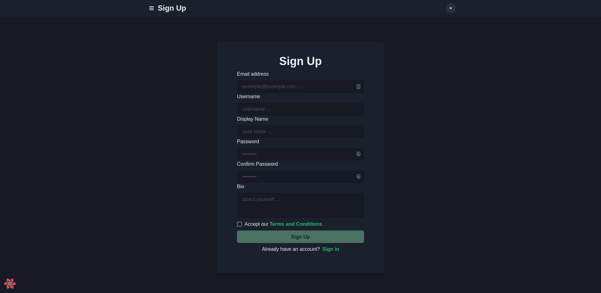

# Fleet

**This is a Social Media App**

-   Preview - [Fleet (Coming Soon)](#)

This is a full stack social media app where you can create an account, follow your friends, discover new people,
and stay up to date with your family and friends. Yout can post an update, like each others posts, reply to each other,
Check out each others profile. You can also message each other in real time to communicate (in development).

This website was developed with efficiency and scalability in mind. The UI was built to be intuitive and responsive.
Server side rendering also maked the UI blazing fast, while also maintaining all the best practises for Search Engine Optimizations.
The database and API was designed using relational data that optimizes the backend performance which can be easily scaled up to expectations.

# Stack

-   [Typescript](https://www.typescriptlang.org/)
-   [Next.js](https://nextjs.org/)
-   [React](https://reactjs.org)
-   [React Query](https://react-query.tanstack.com/)
-   [Zustand](https://github.com/pmndrs/zustand)
-   [Chakra-UI](https://chakra-ui.com/)
-   [Nodejs](https://nodejs.org/en/)
-   [Prisma](https://www.prisma.io/)
-   [SQLite](https://www.sqlite.org/index.html)

### Demo

<div align="center">
    
    
    
    
    
</div>

# If you want to run this application on your own follow the procedure below

## Requirements

-   Node.js v12 or higher.
-   Pnpm
-   SQLite
-   Git

## Clone the Repository

```
git clone https://github.com/FourLineCode/fleet.git
```

## Install Dependencies

```
pnpm install
```

## Migrate database

```
pnpm migrate
```

## Run in production mode

```
pnpm build && pnpm start
```

## Run in development mode

```
pnpm dev
```
